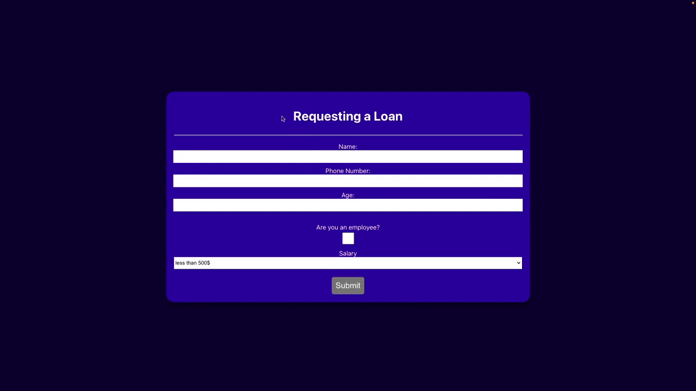

# 📝 loan-application-form

**A responsive web application that simulates a basic loan request form.**  

🎯 This is my **first official project after completing the React course** 💪  
🚀 From the Udemy course by Eng. **Yarob Al Mostafa** ([Tarmeez Academy](https://www.youtube.com/@tarmeez))

---

## 📖 Project Description

This project is a simple form-based React app that collects basic user data as part of a mock **loan application**.  
It includes fields for name, phone number, age, employment status, salary selection, and a submit button.

---

## ✅ Features

- 🧍 Full Name input field  
- 📞 Phone Number input field  
- 🎂 Age input field  
- 👔 Employment status (Yes/No)  
- 💰 Salary range dropdown  
- 📨 Submit button with basic validation  
- 📱 Responsive layout  

---

## 🧠 React Concepts Used

| Concept              | Usage                                             |
|----------------------|---------------------------------------------------|
| `useState`           | Manage input values and form state                |
| `event handling`     | Handle user interactions (onChange, onSubmit)     |
| `conditional rendering` | Show/hide elements based on state             |

---

## 🧰 Tools & Libraries

| Tool              | Purpose                             |
|-------------------|-------------------------------------|
| **React**         | Build the interactive UI            |
| **HTML/CSS**      | Structure and style the components  |
| **ESLint**        | Code quality and linting            |
| **GitHub Pages**  | Live hosting for the project        |
| **MUI** *(optional)* | UI components and layout (if used) |

---

## 📸 Screenshots

### 💻 Desktop View

---

## 📝 Notes

- ✅ This project was **completed on March 18, 2025**.
- ⏳ Upload was delayed intentionally to focus on **completing the full React course** first.
- It's a great starter for practicing form handling in React.

---

## 📚 Useful Links

### 🎓 Course & Instructor

- 📘 React Course on Udemy:  
  [https://www.udemy.com/course/tarmeezacademy-react/](https://www.udemy.com/course/tarmeezacademy-react/)

- 📺 Tarmeez Academy YouTube Channel:  
  [https://www.youtube.com/@tarmeez](https://www.youtube.com/@tarmeez)

- 👨‍💻 Eng. Yarob Al Mostafa on GitHub:  
  [https://github.com/Yarob50](https://github.com/Yarob50)

---

## 🙋‍♂️ About Me

- 📧 Email: [maher.elmair.dev@gmail.com](mailto:maher.elmair.dev@gmail.com)  
- 🔗 LinkedIn: [https://www.linkedin.com/in/maher-elmair-831042237](https://www.linkedin.com/in/maher-elmair-831042237?utm_source=share&utm_campaign=share_via&utm_content=profile&utm_medium=android_app)

---

## 🔗 Live Preview

🎥 **View the project live on GitHub Pages:**

🌐 [https://maher-elmair.github.io/loan-application-form/](https://maher-elmair.github.io/loan-application-form/)

---

## 🙌 Thank You

If you liked the project, please ⭐ the repository!  
Feel free to open issues or submit pull requests with improvements 🙏

---
